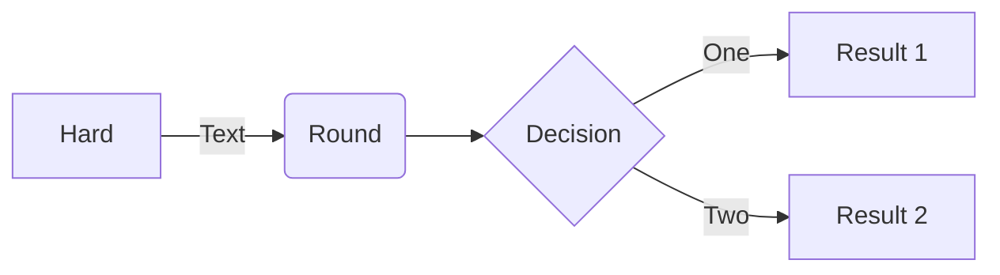
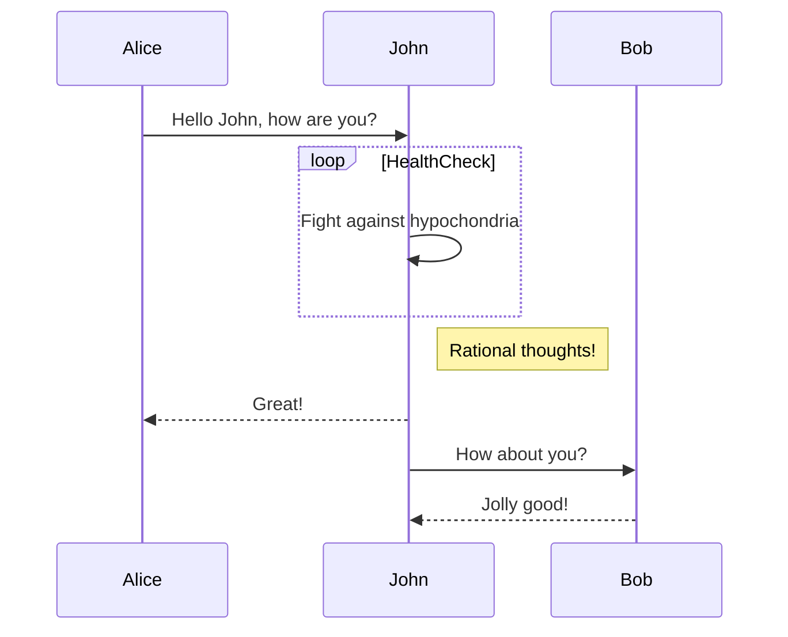
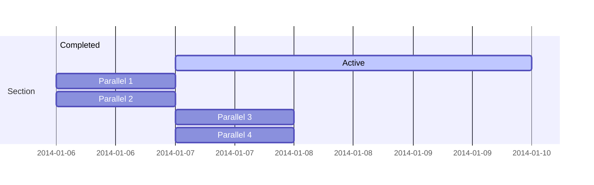
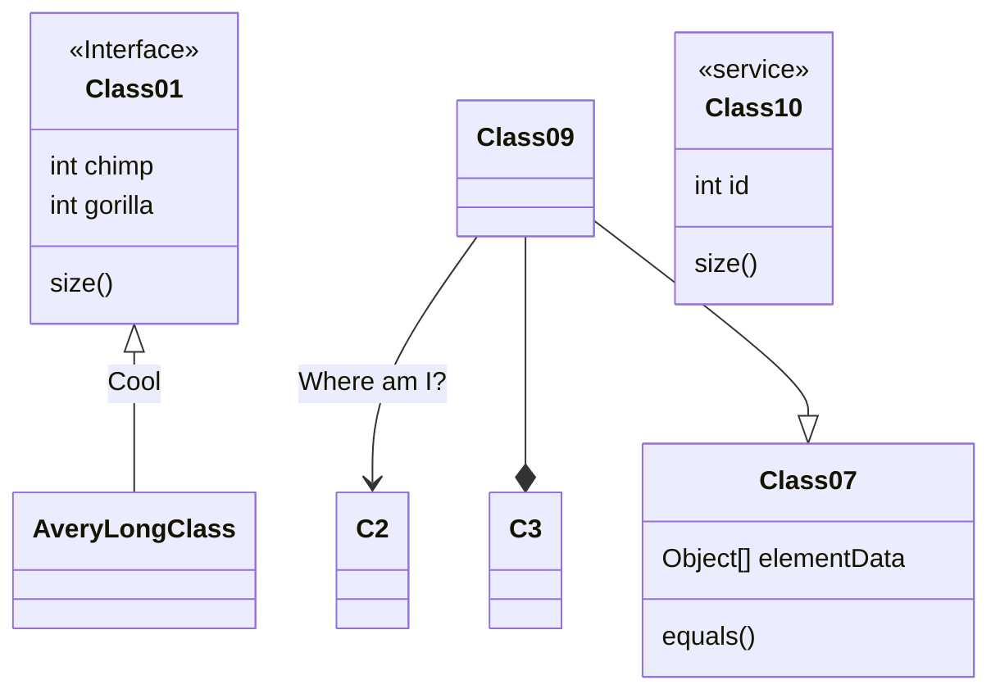
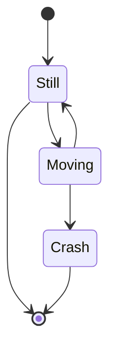
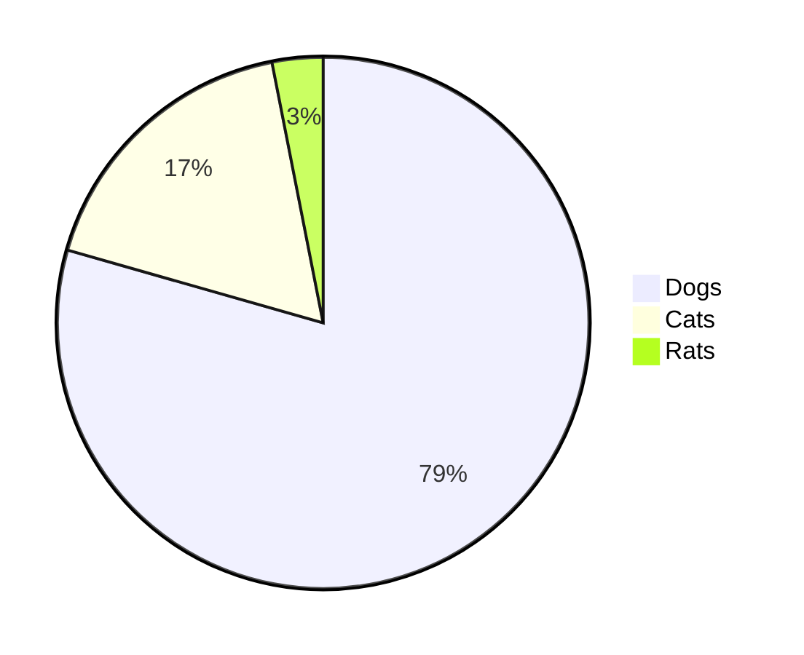
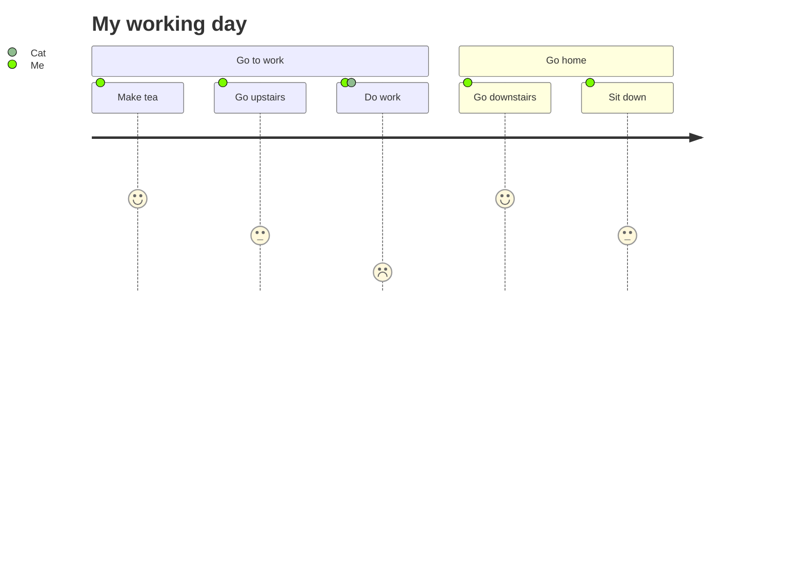
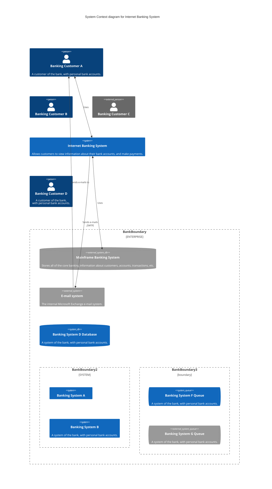

<p align="center">

</p>
<h1 align="center">
Mermaid
</h1>
<p align="center">
通過解析類 Markdown 的文本語法來實現圖表的創建和動態修改。
<p>
<p align="center">
  <a href="https://www.npmjs.com/package/mermaid"></a>
<p>

<p align="center">
<a href="https://mermaid.live/"><b>實時編輯器!</b></a>
</p>
<p align="center">
 <a href="https://mermaid.js.org">📖 文檔</a> | <a href="https://mermaid.js.org/intro/">🚀 入門</a> | <a href="https://www.jsdelivr.com/package/npm/mermaid">🌐 CDN</a> | <a href="https://discord.gg/sKeNQX4Wtj" title="Discord invite">🙌 加入我們</a>
</p>

<p align="center">
嘗試未來版本的實時編輯器預覽: <a href="https://develop.git.mermaid.live/" title="嘗試來自develop分支的mermaid版本。">Develop</a> | <a href="https://next.git.mermaid.live/" title="嘗試來自next分支的mermaid版本。">Next</a>
</p>

<br>

## 關於 Mermaid

<!-- <Main description>   -->

Mermaid 是一個基於 Javascript 的圖表繪製工具，通過解析類 Markdown 的文本語法來實現圖表的創建和動態修改。Mermaid 誕生的主要目的是讓文檔的更新能夠及時跟上開發進度。

> Doc-Rot 是 Mermaid 致力於解決的一個難題。

繪圖和編寫文檔花費了開發者寶貴的開發時間，而且隨著業務的變更，它很快就會過期。 但是如果缺少了圖表或文檔，對於生產力和團隊新人的業務學習都會產生巨大的阻礙。 <br/>
Mermaid 通過允許用戶創建便於修改的圖表來解決這一難題，它也可以作為生產腳本（或其他代碼）的一部分。<br/>
<br/>
Mermaid 甚至能讓非程序員也能通過 [Mermaid Live Editor](https://mermaid.live/) 輕鬆創建詳細的圖表。<br/>
你可以訪問 [教程](https://mermaid.js.org/ecosystem/tutorials.html) 來查看 Live Editor 的視頻教程，也可以查看 [Mermaid 的集成和使用](https://mermaid.js.org/ecosystem/integrations-community.html) 這個清單來檢查你的文檔工具是否已經集成了 Mermaid 支持。

如果想要查看關於 Mermaid 更詳細的介紹及基礎使用方式，可以查看 [入門指引](https://mermaid.js.org/intro/getting-started.html), [用法](https://mermaid.js.org/config/usage.html) 和 [教程](https://mermaid.js.org/ecosystem/tutorials.html).

<!-- </Main description> -->

## 示例

**下面是一些可以使用 Mermaid 創建的圖表示例。點擊 [語法](https://mermaid.js.org/intro/syntax-reference.html) 查看詳情。**

<table>
<!-- <Flowchart> -->

### 流程圖 [<a href="https://mermaid.js.org/syntax/flowchart.html">文檔</a> - <a href="https://mermaid.live/edit#base64:eyJjb2RlIjoiZ3JhcGggVERcbiAgICBBW0hhcmRdIC0tPnxUZXh0fCBCKFJvdW5kKVxuICAgIEIgLS0-IEN7RGVjaXNpb259XG4gICAgQyAtLT58T25lfCBEW1Jlc3VsdCAxXVxuICAgIEMgLS0-fFR3b3wgRVtSZXN1bHQgMl0iLCJtZXJtYWlkIjp7InRoZW1lIjoiZGVmYXVsdCJ9fQ">live editor</a>]

```
flowchart LR
A[Hard] -->|Text| B(Round)
B --> C{Decision}
C -->|One| D[Result 1]
C -->|Two| E[Result 2]
```



### 時序圖 [<a href="https://mermaid.js.org/syntax/sequenceDiagram.html">文檔</a> - <a href="https://mermaid.live/edit#base64:eyJjb2RlIjoic2VxdWVuY2VEaWFncmFtXG5BbGljZS0-PkpvaG46IEhlbGxvIEpvaG4sIGhvdyBhcmUgeW91P1xubG9vcCBIZWFsdGhjaGVja1xuICAgIEpvaG4tPj5Kb2huOiBGaWdodCBhZ2FpbnN0IGh5cG9jaG9uZHJpYVxuZW5kXG5Ob3RlIHJpZ2h0IG9mIEpvaG46IFJhdGlvbmFsIHRob3VnaHRzIVxuSm9obi0tPj5BbGljZTogR3JlYXQhXG5Kb2huLT4-Qm9iOiBIb3cgYWJvdXQgeW91P1xuQm9iLS0-PkpvaG46IEpvbGx5IGdvb2QhIiwibWVybWFpZCI6eyJ0aGVtZSI6ImRlZmF1bHQifX0">live editor</a>]

```
sequenceDiagram
Alice->>John: Hello John, how are you?
loop HealthCheck
    John->>John: Fight against hypochondria
end
Note right of John: Rational thoughts!
John-->>Alice: Great!
John->>Bob: How about you?
Bob-->>John: Jolly good!
```



### 甘特圖 [<a href="https://mermaid.js.org/syntax/gantt.html">文檔</a> - <a href="https://mermaid.live/edit#base64:eyJjb2RlIjoiZ2FudHRcbnNlY3Rpb24gU2VjdGlvblxuQ29tcGxldGVkIDpkb25lLCAgICBkZXMxLCAyMDE0LTAxLTA2LDIwMTQtMDEtMDhcbkFjdGl2ZSAgICAgICAgOmFjdGl2ZSwgIGRlczIsIDIwMTQtMDEtMDcsIDNkXG5QYXJhbGxlbCAxICAgOiAgICAgICAgIGRlczMsIGFmdGVyIGRlczEsIDFkXG5QYXJhbGxlbCAyICAgOiAgICAgICAgIGRlczQsIGFmdGVyIGRlczEsIDFkXG5QYXJhbGxlbCAzICAgOiAgICAgICAgIGRlczUsIGFmdGVyIGRlczMsIDFkXG5QYXJhbGxlbCA0ICAgOiAgICAgICAgIGRlczYsIGFmdGVyIGRlczQsIDFkIiwibWVybWFpZCI6eyJ0aGVtZSI6ImRlZmF1bHQifX0">live editor</a>]

```
gantt
    section Section
    Completed :done,    des1, 2014-01-06,2014-01-08
    Active        :active,  des2, 2014-01-07, 3d
    Parallel 1   :         des3, after des1, 1d
    Parallel 2   :         des4, after des1, 1d
    Parallel 3   :         des5, after des3, 1d
    Parallel 4   :         des6, after des4, 1d
```



### 類圖 [<a href="https://mermaid.js.org/syntax/classDiagram.html">文檔</a> - <a href="https://mermaid.live/edit#base64:eyJjb2RlIjoiY2xhc3NEaWFncmFtXG5DbGFzczAxIDx8LS0gQXZlcnlMb25nQ2xhc3MgOiBDb29sXG48PGludGVyZmFjZT4-IENsYXNzMDFcbkNsYXNzMDkgLS0-IEMyIDogV2hlcmUgYW0gaT9cbkNsYXNzMDkgLS0qIEMzXG5DbGFzczA5IC0tfD4gQ2xhc3MwN1xuQ2xhc3MwNyA6IGVxdWFscygpXG5DbGFzczA3IDogT2JqZWN0W10gZWxlbWVudERhdGFcbkNsYXNzMDEgOiBzaXplKClcbkNsYXNzMDEgOiBpbnQgY2hpbXBcbkNsYXNzMDEgOiBpbnQgZ29yaWxsYVxuY2xhc3MgQ2xhc3MxMCB7XG4gID4-c2VydmljZT4-XG4gIGludCBpZFxuICBzaXplKClcbn0iLCJtZXJtYWlkIjp7InRoZW1lIjoiZGVmYXVsdCJ9fQ">live editor</a>]

```
classDiagram
Class01 <|-- AveryLongClass : Cool
<<Interface>> Class01
Class09 --> C2 : Where am I?
Class09 --* C3
Class09 --|> Class07
Class07 : equals()
Class07 : Object[] elementData
Class01 : size()
Class01 : int chimp
Class01 : int gorilla
class Class10 {
  <<service>>
  int id
  size()
}
```



### 狀態圖 [<a href="https://mermaid.js.org/syntax/stateDiagram.html">文檔</a> - <a href="https://mermaid.live/edit#pako:eNpdkLsOwjAMRX-l8ojahTEDCzB26kgYrMYtkfJAqVMJVf13QiIKqqfr44d8vUDvFYGAiZHponEMaJv5KF2V4na4V01zqjrWxhSUZYapuEetn7UbCy16P_5HzwGnR6FZfpdCDZaCRa3SWcunQQI_yJIEkaSiAaNhCdKtqRUj--7lehAcItUQn-pnBMSAZtroVWn2YYOU07b4z29Y37gJVYk">live editor</a>]

```
stateDiagram-v2
[*] --> Still
Still --> [*]
Still --> Moving
Moving --> Still
Moving --> Crash
Crash --> [*]
```



### 餅圖 [<a href="https://mermaid.js.org/syntax/pie.html">文檔</a> - <a href="https://mermaid.live/edit#base64:eyJjb2RlIjoicGllXG5cIkRvZ3NcIiA6IDQyLjk2XG5cIkNhdHNcIiA6IDUwLjA1XG5cIlJhdHNcIiA6IDEwLjAxIiwibWVybWFpZCI6eyJ0aGVtZSI6ImRlZmF1bHQifX0">live editor</a>]

```
pie
"Dogs" : 386
"Cats" : 85
"Rats" : 15
```



### Git 圖 [實驗特性 - <a href="https://mermaid.live/edit#base64:eyJjb2RlIjoiZ2l0R3JhcGg6XG5vcHRpb25zXG57XG4gICAgXCJub2RlU3BhY2luZ1wiOiAxNTAsXG4gICAgXCJub2RlUmFkaXVzXCI6IDEwXG59XG5lbmRcbmNvbW1pdFxuYnJhbmNoIG5ld2JyYW5jaFxuY2hlY2tvdXQgbmV3YnJhbmNoXG5jb21taXRcbmNvbW1pdFxuY2hlY2tvdXQgbWFzdGVyXG5jb21taXRcbmNvbW1pdFxubWVyZ2UgbmV3YnJhbmNoXG4iLCJtZXJtYWlkIjp7InRoZW1lIjoiZGVmYXVsdCJ9fQ">live editor</a>]

### 用戶體驗旅程圖 [<a href="https://mermaid.js.org/syntax/userJourney.html">文檔</a> - <a href="https://mermaid.live/edit#pako:eNpljzEPgkAMhf9K05nFGJdbJXFiYmVpuKIncDVHL4QQ_ruHaILaqXnf63vpjLVYRoMAd4nB81R5SKNOO4ZiglFC6_wVLL3JwLU68XARUHnhTQcoqGVQJgMnAwV_5GSMj0HJhcHAcU_y7d7AYVUzOJP-ddyk3ydZGf0n66uldPqCPxWYYc-hJ2fTj_OqVqg3Tplo0mq5odhphZVfkpWiSjn5Go2GyBnGhyXl3NE1UI-moW7g5QkSoF5m">live editor</a>]

```
  journey
    title My working day
    section Go to work
      Make tea: 5: Me
      Go upstairs: 3: Me
      Do work: 1: Me, Cat
    section Go home
      Go downstairs: 5: Me
      Sit down: 3: Me
```



### C4 圖 [<a href="https://mermaid.js.org/syntax/c4.html">文檔</a>]

```
C4Context
title System Context diagram for Internet Banking System

Person(customerA, "Banking Customer A", "A customer of the bank, with personal bank accounts.")
Person(customerB, "Banking Customer B")
Person_Ext(customerC, "Banking Customer C")
System(SystemAA, "Internet Banking System", "Allows customers to view information about their bank accounts, and make payments.")

Person(customerD, "Banking Customer D", "A customer of the bank, <br/> with personal bank accounts.")

Enterprise_Boundary(b1, "BankBoundary") {

  SystemDb_Ext(SystemE, "Mainframe Banking System", "Stores all of the core banking information about customers, accounts, transactions, etc.")

  System_Boundary(b2, "BankBoundary2") {
    System(SystemA, "Banking System A")
    System(SystemB, "Banking System B", "A system of the bank, with personal bank accounts.")
  }

  System_Ext(SystemC, "E-mail system", "The internal Microsoft Exchange e-mail system.")
  SystemDb(SystemD, "Banking System D Database", "A system of the bank, with personal bank accounts.")

  Boundary(b3, "BankBoundary3", "boundary") {
    SystemQueue(SystemF, "Banking System F Queue", "A system of the bank, with personal bank accounts.")
    SystemQueue_Ext(SystemG, "Banking System G Queue", "A system of the bank, with personal bank accounts.")
  }
}

BiRel(customerA, SystemAA, "Uses")
BiRel(SystemAA, SystemE, "Uses")
Rel(SystemAA, SystemC, "Sends e-mails", "SMTP")
Rel(SystemC, customerA, "Sends e-mails to")
```



## 發佈

對於有權限的同學來說，你可以通過以下步驟來完成發佈操作：

更新 `package.json` 中的版本號，然後執行如下命令：

```sh
npm publish
```

以上的命令會將文件打包到 `dist` 目錄並發佈至 <https://www.npmjs.com>.

## 相關項目

- [Command Line Interface](https://github.com/mermaid-js/mermaid-cli)
- [Live Editor](https://github.com/mermaid-js/mermaid-live-editor)
- [HTTP Server](https://github.com/TomWright/mermaid-server)

## 貢獻者 [](https://github.com/mermaid-js/mermaid/issues?q=is%3Aissue+is%3Aopen+label%3A%22Good+first+issue%21%22) [](https://github.com/mermaid-js/mermaid/graphs/contributors) [](https://github.com/mermaid-js/mermaid/graphs/contributors)

Mermaid 是一個不斷發展中的社區，並且還在接收新的貢獻者。有很多不同的方式可以參與進來，而且我們還在尋找額外的幫助。如果你想知道如何開始貢獻，請查看 [這個 issue](https://github.com/mermaid-js/mermaid/issues/866)。

關於如何貢獻的詳細信息可以在 [貢獻指南](https://mermaid.js.org/community/contributing.html) 中找到。

## 安全

對於公開網站來說，從互聯網上的用戶處檢索文本、存儲供後續在瀏覽器中展示的內容可能是不安全的，理由是用戶的內容可能嵌入一些數據加載完成之後就會運行的惡意腳本，這些對於 Mermaid 來說毫無疑問是一個風險，尤其是 mermaid 圖表還包含了許多在 html 中使用的字符，這意味著我們難以使用常規的手段來過濾不安全代碼，因為這些常規手段會造成圖表損壞。我們仍然在努力對獲取到的代碼進行安全過濾並不斷完善我們的程序，但很難保證沒有漏洞。

作為擁有外部用戶的網站的額外安全級別，我們很高興推出一個新的安全級別，其中的圖表在沙盒 iframe 中渲染，防止代碼中的 javascript 被執行，這是在安全性方面邁出的一大步。

_很不幸的是，魚與熊掌不可兼得，在這個場景下它意味著在可能的惡意代碼被阻止時，也會損失部分交互能力_。

## 報告漏洞

如果想要報告漏洞，請發送郵件到 security@mermaid.live, 並附上問題的描述、復現問題的步驟、受影響的版本，以及解決問題的方案（如果有的話）。

## 鳴謝

來自 Knut Sveidqvist:

> _特別感謝 [d3](https://d3js.org/) 和 [dagre-d3](https://github.com/cpettitt/dagre-d3) 這兩個優秀的項目，它們提供了圖形佈局和繪圖工具庫！_ > _同樣感謝 [js-sequence-diagram](https://bramp.github.io/js-sequence-diagrams) 提供了時序圖語法的使用。 感謝 Jessica Peter 提供了甘特圖渲染的靈感。_ > _感謝 [Tyler Long](https://github.com/tylerlong) 從 2017 年四月開始成為了項目的合作者。_
>
> _感謝越來越多的 [貢獻者們](https://github.com/mermaid-js/mermaid/graphs/contributors)，沒有你們，就沒有這個項目的今天！_

---

_Mermaid 是由 Knut Sveidqvist 創建，它為了更簡單的文檔編寫而生。_