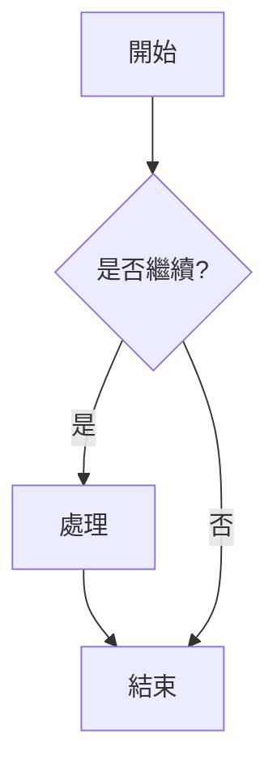
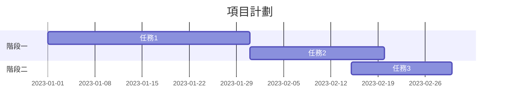
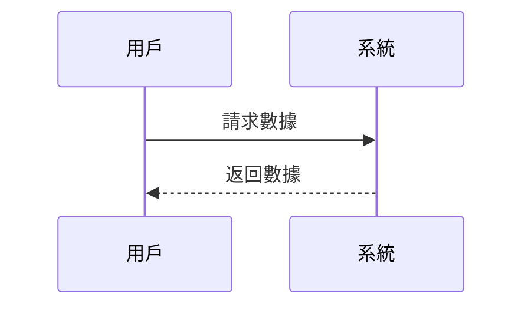
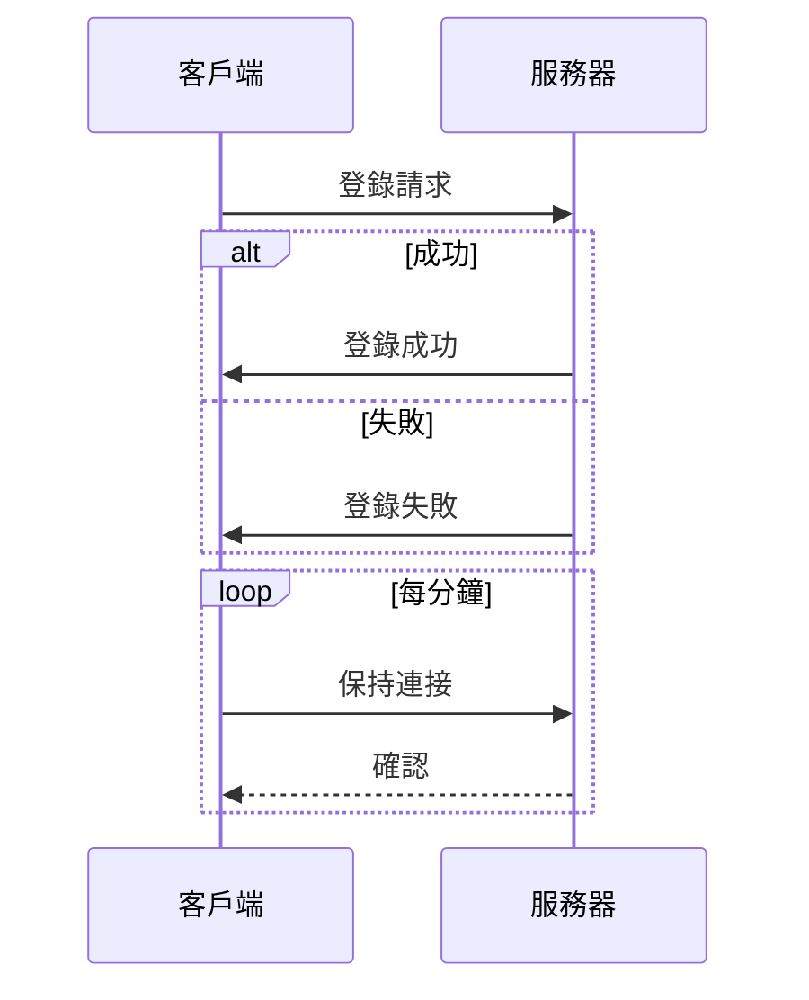

# Mermaid 教學文件

## 簡介

Mermaid 是一個基於 JavaScript 的圖表繪製工具，允許用戶通過文字和代碼創建各種圖表和視覺化內容。它使用類似 Markdown 的語法，讓您能夠輕鬆地創建和修改複雜的圖表。

## 1. 流程圖 (Flowchart)

流程圖用於顯示步驟、決策和過程流程。

### 基本語法

```
flowchart TD
    A[開始] --> B{是否繼續?}
    B -->|是| C[處理]
    C --> D[結束]
    B -->|否| D
```

顯示效果：



### 節點形狀

- `[]` 矩形
- `()` 圓角矩形
- `{}` 菱形
- `[[]]` 子程序形狀
- `[()]` 圓柱形
- `(())` 圓形

### 連接線

- `-->` 箭頭連接
- `---` 線條連接
- `-.->` 虛線箭頭
- `-.-` 虛線連接
- `==>` 粗箭頭
- `===` 粗線條


## 2. 甘特圖 (Gantt Diagram)

甘特圖用於項目管理，顯示任務、持續時間和時間線。

### 基本語法

```
gantt
    title 項目計劃
    dateFormat YYYY-MM-DD
    section 階段一
    任務1 :a1, 2023-01-01, 30d
    任務2 :after a1, 20d
    section 階段二
    任務3 :2023-02-15, 15d
```

顯示效果：



### 關鍵元素

- `title` - 圖表標題
- `dateFormat` - 日期格式
- `section` - 任務分組
- 任務定義 - `任務名稱 :id, 開始日期, 持續時間`


## 3. 序列圖 (Sequence Diagram)

序列圖用於顯示對象之間的交互和消息傳遞時序。

### 基本語法

```
sequenceDiagram
    participant A as 用戶
    participant B as 系統
    A->>B: 請求數據
    B-->>A: 返回數據
```

顯示效果：



### 關鍵元素

- `participant` - 定義參與者
- 箭頭類型:
  - `->>` 實線箭頭
  - `-->>` 虛線箭頭
  - `-x` 末端帶X的箭頭（表示丟失消息）
  - `-)` 開放箭頭

### 循環和條件

```
sequenceDiagram
    participant A as 客戶端
    participant B as 服務器
    
    A->>B: 登錄請求
    alt 成功
        B->>A: 登錄成功
    else 失敗
        B->>A: 登錄失敗
    end
    
    loop 每分鐘
        A->>B: 保持連接
        B-->>A: 確認
    end
```

顯示效果：




## 使用方法

### 在 Markdown 文件中使用

在支援 Mermaid 的 Markdown 編輯器（如 GitHub、GitLab、Notion 等）中，只需使用代碼塊標記並指定語言為 `mermaid`：

```
flowchart LR
    A --> B
```

### 在 HTML 中使用

在 HTML 頁面中添加 Mermaid 腳本並創建一個 `<div>` 元素：

```html
<script type="module">
  import mermaid from 'https://cdn.jsdelivr.net/npm/mermaid@11/dist/mermaid.esm.min.mjs';
  mermaid.initialize({ startOnLoad: true });
</script>

<div class="mermaid">
    flowchart LR
        A --> B
</div>
```

參考資料：[Mermaid 官方文檔](https://mermaid.js.org/intro/) 
